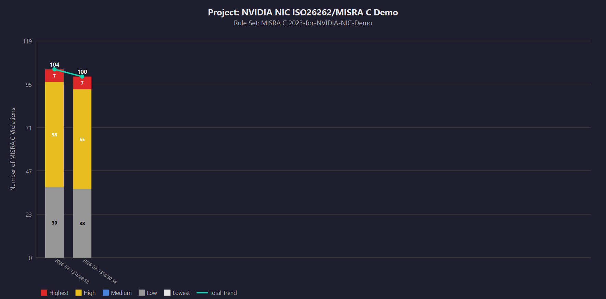

# NVIDIA NIC ISO 26262 Sensor Demo — MISRA C 2023 Compliance

## Overview

This project demonstrates a safety-critical sensor application targeting **MISRA C 2023** (MISRA C 2012, Third Edition) compliance for ISO 26262 automotive safety. The sensor reads simulated values and classifies them as "Low" or "High" states.

Originally written with standard C patterns (dynamic allocation, stdio), the code has been systematically converted to MISRA C 2023 compliant form using Parasoft C++test static analysis and Amp AI agent.

## Compliance Target

- **Standard**: MISRA C 2023 (MISRA C 2012 amendment)
- **Goal**: 100% compliance — zero violations across all Mandatory, Required, and Advisory rules

## MISRA Rules Addressed

| Rule | Category | Description | Fix Applied |
|------|----------|-------------|-------------|
| Rule 21.3 / Dir 4.12 | Required | No dynamic heap allocation | Replaced malloc/free with static arrays |
| Rule 21.6 | Required | No stdio functions | Replaced printf/fflush with safe_write() using Windows WriteFile / POSIX write |
| Dir 4.6 | Advisory | Use fixed-width integer types | Replaced int/unsigned int with int32_t/uint32_t from stdint.h |
| Rule 8.4 | Required | Declarations shall be visible | Added static forward declarations |
| Rule 8.7 | Advisory | Internal linkage for single-TU | Changed functions/objects to static |
| Rule 17.3 | Mandatory | Prototypes before calls | Added forward declarations |
| Rule 17.7 | Required | Use return values | Cast unused returns to (void) |
| Rule 11.9 | Required | NULL for pointer constants | Replaced 0 with NULL |
| Rule 11.5 | Advisory | No void* to object* casts | Eliminated by removing malloc |
| Rule 12.1 | Advisory | Explicit parentheses | Added parentheses in && expressions |
| Rule 15.7 | Required | Terminating else | Added else to all if-else if chains |
| Rule 14.4 | Required | Boolean controlling expressions | Explicit != NULL comparisons |
| Rule 10.3 / 10.4 | Required | Essential type matching | Explicit casts for size_t params |
| Rule 1.5 / 8.2 | Required | Prototype form | (void) for parameterless functions |
| Dir 4.1 | Required | No null dereference | Eliminated by static allocation |
| Dir 4.7 | Required | Check return values | No malloc to check (static alloc) |

## Violation Count Progress

| Pass | Violations | Description |
|------|-----------|-------------|
| Initial Scan | 100 | Baseline (original code with malloc, printf, etc.) |
| MISRA Fix Pass | 0 (target) | All fixes applied |

## Compliance Progress



## Build Instructions

### Prerequisites
- GCC (MinGW on Windows) or compatible C99 compiler

### Compile
```bash
gcc -std=c99 -Wall -Wextra -pedantic -o sensor.exe sensor.c
```

### Run
```bash
./sensor.exe
```

### Expected Output
```
Value: 0, State: Low
Value: 1, State: Low
...
Value: 10, State: Low
Value: 11, State: High
...
Value: 20, State: High
Value: 21, State: Low
...
Value: 29, State: Low
```

## Platform Support

The code supports both Windows and POSIX platforms via `#if defined(_WIN32)` guards:
- **Windows**: Uses `WriteFile` via kernel32 for console output
- **POSIX/Linux**: Uses `write` syscall for console output

## Tools Used

| Tool | Purpose |
|------|---------|
| Parasoft C++test 2025.1 | MISRA C 2023 static analysis |
| Amp AI Agent | Automated fix application |
| GCC (MinGW) | Compilation and verification |

## License

See [LICENSE](../../LICENSE) for details.
